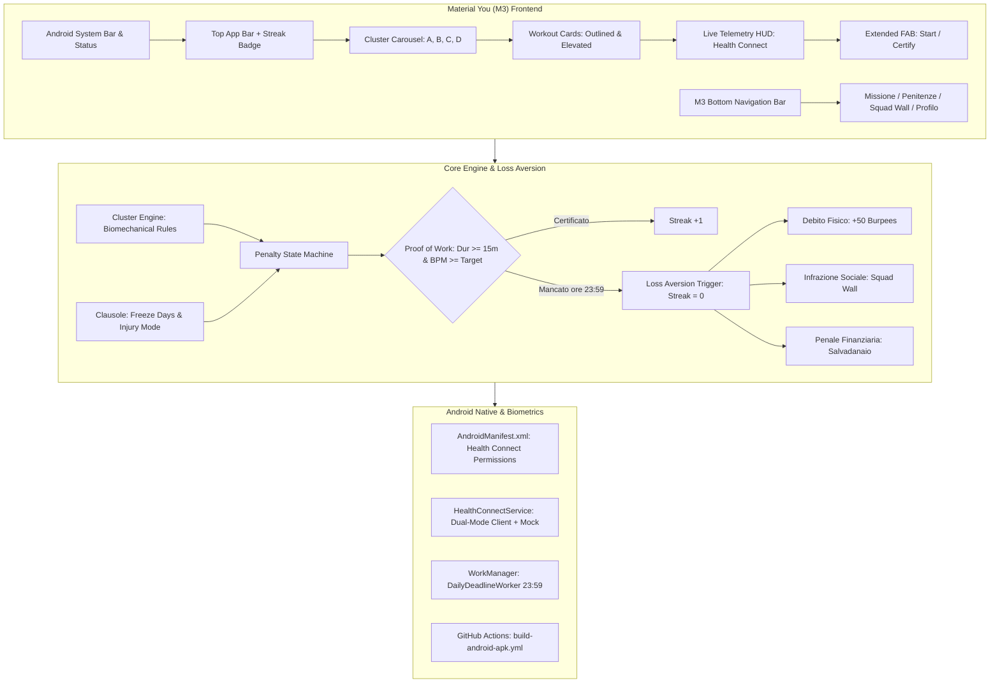

# ⚡ AuraFit — Athletic Conditioning & Biomechanical Loss Aversion (Android & Material You)

[](https://github.com/aurafit-org/aurafit-android/actions/workflows/build-android-apk.yml)
[](https://github.com/aurafit-org/aurafit-android/actions/workflows/lint-and-test.yml)

-795548?logo=google&logoColor=white)


**AuraFit** è un'applicazione mobile Android ad alte prestazioni per il conditioning atletico multi-sport, progettata per debellare l'alto tasso di abbandono (>70% entro i primi 3 mesi) tipico delle app di fitness convenzionali.

Sostituendo le notifiche passive con un **Patto di Impegno basato su Loss Aversion**, la **Proof of Work Biometrica** di Google Health Connect e un'interfaccia aderente alle linee guida ufficiali **Material Design 3 (Material You)**, AuraFit trasforma la routine quotidiana in un dovere atletico certificato.

---

## 🏛️ Architettura di Sistema



---

## 1. 🧬 Architettura a Cluster Biomeccanici

Il motore di AuraFit organizza il micro-conditioning (20–35 minuti) in **4 macro-cluster biomeccanici**, ciascuno focalizzato sulla prevenzione dei traumi specifici dello sport primario:

| Cluster | Nome & Sport Target | Focus Biomeccanico Chiave | Prevenzione Infortuni | BPM Minimi (PoW) |
| :--- | :--- | :--- | :--- | :---: |
| **Cluster A** | **Situazionali & Squadra**<br>*(Calcio, Basket, Padel, Volley)* | Agilità reattiva, cambi di direzione (COD), mobilità caviglia, dissociazione bacino-anca. | Prevenzione rottura legamento crociato anteriore (LCA), pubalgia cronica, distorsioni tibio-tarsiche. | **$\ge 130$ BPM** |
| **Cluster B** | **Forza & Skill**<br>*(Palestra, Calisthenics, Powerlifting)* | Depressione e ritmo scapolo-omerale, salute cuffia dei rotatori, bracing e pressione intra-addominale (IAP). | Sindrome da impingement subacromiale, discinesia scapolare, ernie lombari. | **$\ge 120$ BPM** |
| **Cluster C** | **Endurance & Ciclici**<br>*(Corsa, Ciclismo, Nuoto)* | Catena posteriore a secco, elastic stiffness del tendine d'Achille, mobilità diaframmatica 90/90. | Strappi ischiocrurali (bicipite femorale), tendinopatia achillea, sindrome bandelletta ileotibiale. | **$\ge 135$ BPM** |
| **Cluster D** | **Combat & Reattività**<br>*(Boxe, MMA, Brazilian Jiu-Jitsu)* | Trasferimento di potenza rotazionale dalle anche, resistenza isometrica del collo, buffer lattacido. | Traumi cranici/colpi di frusta, torsioni anomale della colonna, blocco faccette articolari. | **$\ge 140$ BPM** |

---

## 2. ⚖️ Engine Comportamentale di Loss Aversion & Penitenze

Gli studi di economia comportamentale dimostrano che **il dolore della perdita è psicologicamente due volte più potente del piacere del guadagno**.

### Macchina a Stati Giornaliera

Ogni giornata $D$ per l'atleta $U$ segue una macchina a stati finiti:
- `SCHEDULED`: Sessione assegnata la mattina, in attesa di certificazione.
- `IN_PROGRESS`: Timer attivo con streaming biometrico live.
- `VERIFIED`: Health Connect convalida i parametri biometrici:
  $$\text{Proof of Work} \iff (\text{Durata} \ge 15\text{ min}) \land (\text{BPM medi} \ge \text{Target del Cluster})$$
  $\implies \text{Streak} = \text{Streak} + 1$.
- `FROZEN`: Freeze Day criogenico attivato (max 2 al mese). La streak viene preservata intatta e le penitenze sono disattivate.
- `INJURED`: Modalità infortunio attivata dall'atleta. La scheda viene convertita in decompressione e mobilità passiva; penitenze congelate.
- `MISSED`: Scatta automaticamente alle **23:59:00** se la sessione non è verificata:
  $$\text{Streak} = 0 \quad (\text{Azzera lo storico})$$
  Inoltre, viene applicata la penitenza scelta nel Patto di Impegno:
  - **Fisica:** Incremento del debito motorio ($+50$, $+100$ o $+150$ Burpees obbligatori da completare).
  - **Sociale:** Pubblicazione automatica dell'infrazione sullo **Squad Wall** di squadra con etichetta di inadempienza.
  - **Finanziaria:** Addebito simbolico (€2, €5 o €10) verso il salvadanaio di gruppo.

---

## 3. 🎨 Design System Material Design 3 (Material You)

L'applicazione segue fedelmente i principi **M3** di Android:

- **Dynamic Monet Theming:** Palette dinamiche con supporto a `Forest Teal`, `Deep Violet`, `Ocean Blue` e `Amber Sunset`, più commutazione istantanea Dark/Light mode OLED.
- **Tonal Elevation:** Nessuna ombra netta in stile iOS; la profondità visiva è resa unicamente mediante sovrapposizione di tonalità semantiche (`surface-container-low`, `surface-container`, `surface-container-high`).
- **Android Bottom Navigation Bar:** 4 destinazioni fluide con indicatore di selezione a pillola (`navigation-pill`):
  1. **Oggi / Missione:** Selezione cluster, scheda routine, telemetria in tempo reale.
  2. **Penitenze & Debiti:** Cockpit Loss Aversion, contatore burpees pendenti, salvadanaio.
  3. **Squad Wall:** Bacheca sociale della squadra, infrazioni e batti-cinque.
  4. **Profilo & Jolly:** Saldo Freeze Days (2/2), impostazioni atleta e diagnostica Android.
- **Extended FAB:** Floating Action Button ancorato con micro-animazioni ripple e switch dinamico ("Avvia Telemetria" $\rightarrow$ "Certifica Proof of Work").
- **M3 Cards:** `OutlinedCard` per le stazioni di allenamento ed `ElevatedCard` per l'HUD telemetrico e le notifiche di penitenza.

---

## 4. ⌚ Integrazione Android & Google Health Connect

Nel layer nativo Android (`android/app/`):
- **Permessi Health Connect (`AndroidManifest.xml`):**
  - `android.permission.health.READ_HEART_RATE`
  - `android.permission.health.READ_ACTIVE_CALORIES_BURNED`
  - `android.permission.health.READ_EXERCISE`
- **Fallback & Mock Telemetry Provider (`HealthConnectService.ts`):** Rileva l'ambiente di esecuzione: in emulatore o browser preview genera telemetria realistica con variabilità cardiaca (HRV jitter), simulatore di intensità (Riposo, Target Cluster, Sprint) e funzione di avanzamento rapido (+15 min).
- **Background WorkManager (`DailyDeadlineWorker.kt`):** Esegue il controllo di scadenza alle **23:59** emettendo una notifica di sistema ad alta priorità sul canale `CHANNEL_PENALTY_ALERT`.

---

## 5. 🚀 CI/CD GitHub Actions: Compilazione Automatica APK

Il repository include un workflow production-ready in `.github/workflows/build-android-apk.yml`:
1. Checkout automatico del codice su `push` nei branch `main` e `release/**`.
2. Setup Java 17 Temurin con cache Gradle.
3. Setup Node.js 20 con cache npm.
4. Esecuzione dei test unitari (`npm test` con Vitest).
5. Compilazione del bundle ottimizzato (`npm run build`).
6. Esecuzione Gradle: `./gradlew assembleDebug --stacktrace`.
7. Upload dell'APK generato come Artifact scaricabile direttamente da GitHub Actions:
   - **Nome Artifact:** `aurafit-m3-debug-apk`
   - **File:** `android/app/build/outputs/apk/debug/aurafit-debug.apk`

---

## 6. 🛠️ Guida di Installazione e Sviluppo

### Prerequisiti
- Node.js $\ge 18$ (consigliato Node 20 o 22)
- JDK 17 (Temurin o OpenJDK)
- Android Studio Ladybug / Koala o successivo (con Android SDK API 34 installato)

### 1. Clona il repository e installa le dipendenze
```bash
git clone https://github.com/aurafit-org/aurafit-android.git
cd aurafit-android
npm install
```

### 2. Esegui i test unitari
```bash
npm test
```
*Tutti i 17 test unitari verificano:*
- Calcolo e soglie BPM dei 4 cluster biomeccanici.
- Azzeramento streak e applicazione penitenze (Burpees, Social, Financial) allo skip.
- Preservazione della streak e consumo del contingente di Freeze Days.
- Convalida e rifiuto della Proof of Work biometrica di Health Connect.

### 3. Avvia la Preview Interattiva Material You
```bash
npm run dev
```
Apri il browser su `http://localhost:3000` per visualizzare la simulazione mobile Android 14 completa di barre di sistema, FAB dinamico e telemetria dal vivo.

### 4. Compilazione dell'APK Android nativo
Per compilare l'APK Android in locale:
```bash
# Rendi eseguibile il wrapper gradle
chmod +x android/gradlew

# Compila l'APK di Debug
cd android
./gradlew assembleDebug
```
L'APK sarà disponibile in:
`android/app/build/outputs/apk/debug/app-debug.apk`

### 5. Installazione su Dispositivo Fisico Android
Abilita il **Debug USB** sul tuo smartphone Android e lancia:
```bash
adb install -r android/app/build/outputs/apk/debug/app-debug.apk
```

---

## 📁 Struttura del Progetto

```
.
├── .github/
│   ├── workflows/
│   │   ├── build-android-apk.yml    # Workflow CI/CD compilazione automatica APK
│   │   └── lint-and-test.yml        # Test unitari e typecheck TypeScript
│   ├── ISSUE_TEMPLATE/
│   │   ├── bug_report.md            # Segnalazione anomalie
│   │   └── feature_request.md       # Proposte nuovi cluster o penitenze
│   └── pull_request_template.md     # Template unificato per PR
├── android/                         # Configurazione nativa Android / Gradle
│   ├── app/
│   │   ├── build.gradle             # minSdk 26, targetSdk 34, Health Connect client
│   │   └── src/main/
│   │       ├── AndroidManifest.xml  # Permessi biometrici e queries Health Connect
│   │       ├── kotlin/com/aurafit/app/
│   │       │   ├── AuraFitApplication.kt   # WorkManager & notification channels
│   │       │   ├── DailyDeadlineWorker.kt  # Worker alle 23:59 per Loss Aversion
│   │       │   └── MainActivity.kt         # Health Connect Activity contract
│   │       └── res/                 # Token XML M3 (colors.xml, themes.xml, layout)
│   ├── gradlew                      # Gradle wrapper script
│   ├── build.gradle                 # Configurazione root Gradle
│   └── settings.gradle
├── src/
│   ├── core/                        # Engine di dominio puro
│   │   ├── types.ts                 # Modelli TypeScript e contratti
│   │   ├── clusterEngine.ts         # 4 macro-cluster biomeccanici e routine
│   │   └── penaltyStateMachine.ts   # Macchina a stati, streak e loss aversion
│   ├── theme/                       # Design System Material Design 3 (Material You)
│   │   ├── m3Tokens.ts              # Token semantici monet (Teal, Violet, Blue, Amber)
│   │   └── ThemeProvider.tsx        # Context React e iniezione CSS variables
│   ├── services/                    # Integrazioni hardware & biometria
│   │   ├── HealthConnectService.ts  # Client Google Health Connect + Mock Provider
│   │   └── DailyDeadlineWorker.ts   # Simulatore background task
│   ├── components/                  # Componenti UI Material You
│   │   ├── M3SystemBar.tsx          # Barra di sistema Android (5G, WiFi, Batteria, Ore)
│   │   ├── M3TopAppBar.tsx          # Top Bar con streak flame e theme picker
│   │   ├── M3BottomNav.tsx          # Navigation Bar a 4 destinazioni con pills
│   │   ├── M3Fab.tsx                # Extended FAB per avvio/certificazione
│   │   ├── ClusterCarousel.tsx      # Selettore a pillole per sport e cluster
│   │   ├── WorkoutCard.tsx          # Outlined & Elevated exercise cards
│   │   ├── TelemetryPanel.tsx       # Live HUD Health Connect con battito ed ECG
│   │   ├── FreezeModal.tsx          # Modale jolly criogenici
│   │   └── InjuryModal.tsx          # Modale protocollo infortunio
│   ├── screens/                     # Schermate dell'MVP
│   │   ├── MissionScreen.tsx        # Allenamento del giorno e live telemetria
│   │   ├── PenaltiesScreen.tsx      # Gestione patto e debiti burpees/finanziari
│   │   ├── SquadFeedScreen.tsx      # Squad Wall sociale e accountability
│   │   └── ProfileScreen.tsx        # Profilo atleta e diagnostica
│   ├── App.tsx                      # Root component dell'applicazione
│   ├── main.tsx                     # Entrypoint React
│   └── index.css                    # Tailwind CSS + stili M3 & animazioni
├── tests/                           # Suite di test unitari (Vitest)
│   ├── clusterEngine.test.ts
│   ├── penaltyStateMachine.test.ts
│   └── healthConnectService.test.ts
├── package.json
├── tsconfig.json
├── tailwind.config.js
├── vite.config.ts
└── README.md
```

---

## 📄 Licenza

Distribuito con licenza **MIT**. Consulta il file `LICENSE` per ulteriori dettagli.
Progettato e ingegnerizzato con standard **Google Material You (M3)** e **Google Health Connect**.
